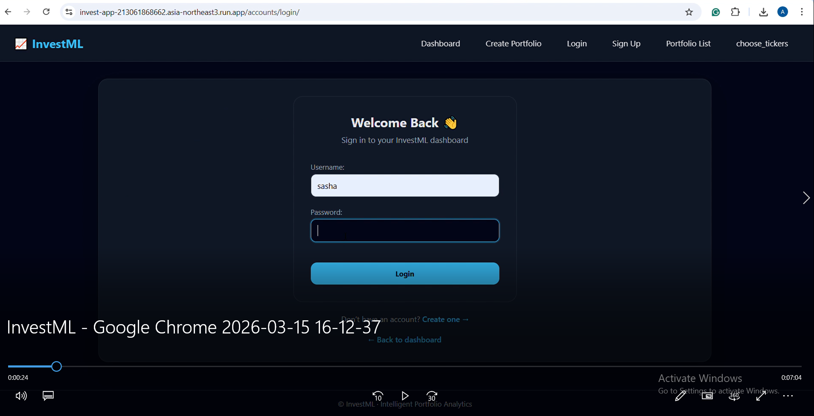
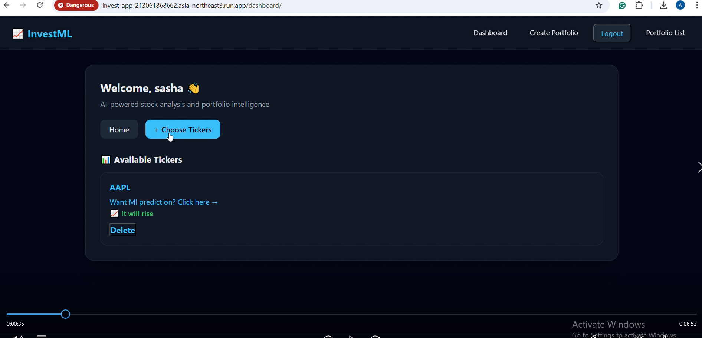
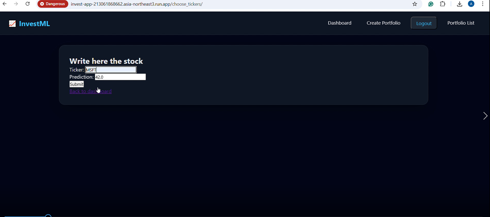
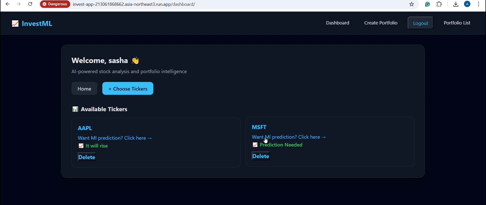
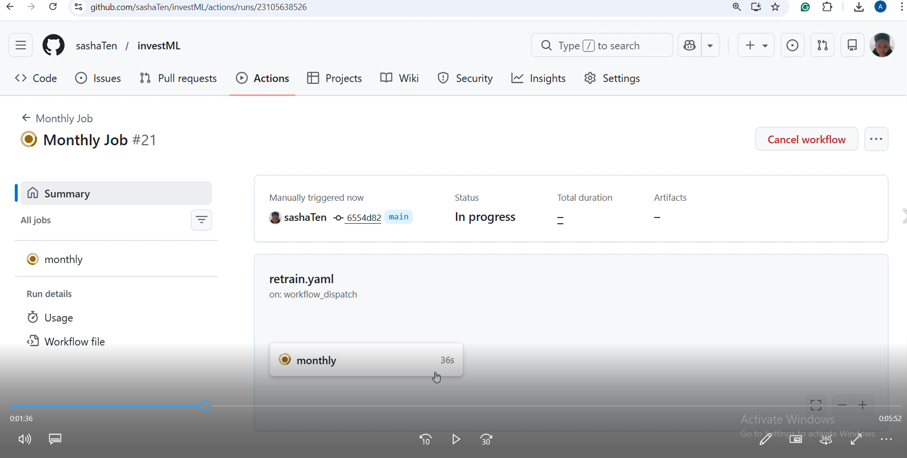
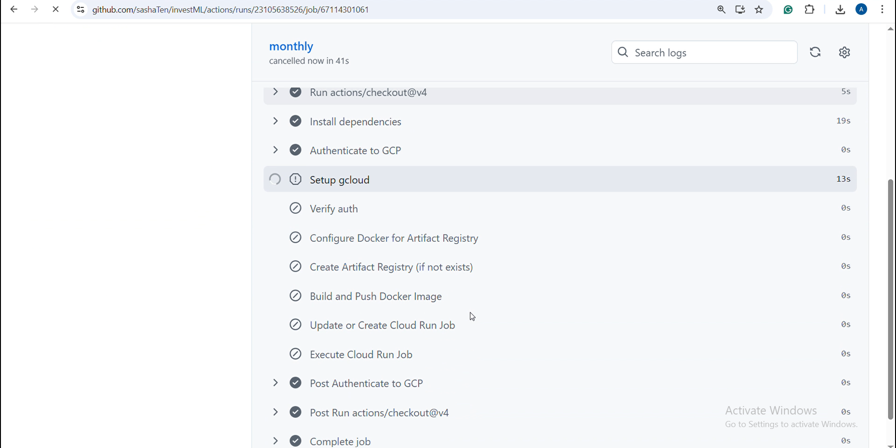
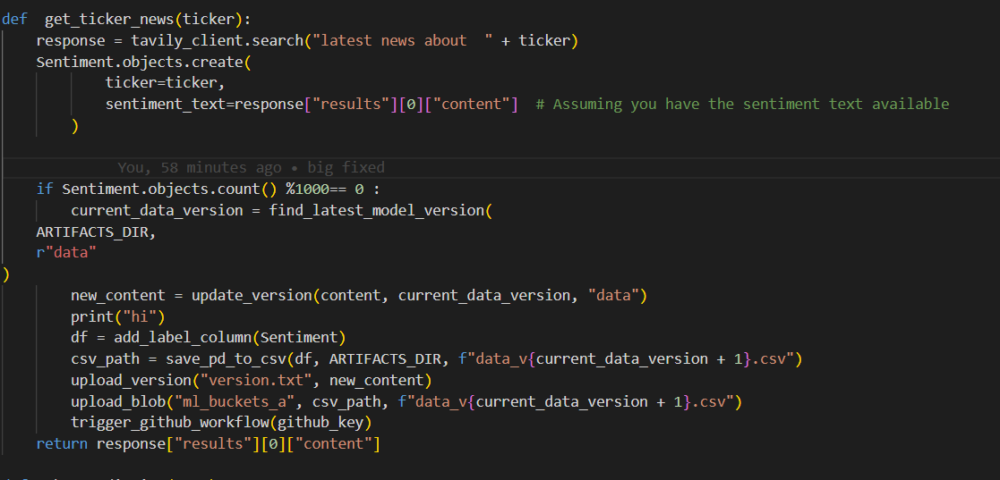

Clone project on a new machine:

git clone https://github.com/you/repo.git
cd repo
python -m venv .venv  and set you api keys for tavely and github
source .venv/bin/activate   # or Windows activate
pip install -r requirements.txt

---

---basic    functionalities  :
homepage -  create account - login - logout - fill the portfolio for risk  evaluation
dashboard - choose stock /delete stock  from portfolio/ get ml prediction
getting allocation with financial eval /  getting the allocation with ml  model

--development pipeline  model is DevOps :

**req . analysis :
1 account management
2 low latency ml prediction
3 stock related latest news  based sentiment prediction
4 ci/cd model for changing code
5 security of api
6 automatic re-train for ml
7 software principles such DRY (OOP and clean code) , microservice architecture , versioning

**development and tech stack :
1 automation and versioning : git ,  github ,  github actions
2 backend  : django , tavely search api , y finance api ,docker , GCP
3 front-end :   html ,  css , js
4 data analysis and ml :  pandas , numpy , sklearn.
5 database :   sqlLite with django ORM

**testing :
integrated   unit tests  with  any  tool
**deployment :
automated deployment using  jenkins/github actions ,  docker  ,  cloud (GCP , Azure or AWS)
**maintainance :

--- ml pipeline :
post -monitoring  with  yfinance

--- how implemented guides   :

* portfolio calculation with yfinance
* re-train :
  in "scripts.py" in the function "get_ticker_news"
  Sentiment db model adds  the ticker and sentiment text to the db,
  if Sentiment.objects.count()%1000== 0

# finds latest data version

# updates version.txt in the cloud and triggers workflow to retrain the model with new data

sentiment model goes  to add_label_column where 5 latest dates cuttof are applied due
y-finance holidays.   labeling and monitoring are done with  y-finance
we get the prices  of start date and next  day   with 10 days  range
with  not   None vals from trading holidays so no None i and next i
we get the   difference and if raised   the label  is 1 if
decreased  the label  is  0.  then  label  is  attached to the sentiment model
where to date  and  text    row.
then  the version.txt file in the cloud  is  updated  from  the  string
and the new df saved in  project  goes to  cloud.
then  retrain    pipeline  is   triggered  with post http   method
you   define the in   url  the repo/workflow/file  and secret  token
you trigger the  workflow dispatch .

in  the   retrain.yaml "  working-directory: ml_code"
is because it the  same  repo  but   it   is  inner  folder
because  the docker of that  folder is   invisible  for  global   docker
so  technically  it   is   another microservice   even  though  it is  same repo.
then just setup  the gcloud   as  you  would in the bash
artifacts registry -> builds -> run  update || or  run create -> jobs  execute
"in simple words :  github runs  virtual job  which   goes to   your  folder ml_code
which   has  dockerfile  and script for   auto -retrain ,  then   it  deploys and runs
the dockerized script in the cloud"

retrain.py :
gets   version   from  cloud
uploads    updated  version  file
prepares  the data
concats  with   prev data
trains   model   and   saved   3 ml  artifacts
applies  versioning   by  naming the   artifacts   with f"curent version+1"
and  uploads   aritfacts   to  the  cloud.
while

*CI/CD :
*django.yaml
on push  github   loads the   code
same   fasion  as retrain
but deploy  pytest   step  added
and the  deploy    instead  of create  or   update
because it  is gCloud Run service  and  job.
dont forget --set-env-vars THE_KEY=$THE_KEY,KEY_GITHUB=${{ secrets.KEY_GITHUB }}

----further improvements   :
*scripts.py.    -    it checks   versions  and   loads if   new  available
it is better  to put  this  logic   not in  global   scripts but after
Sentiment.objects.count()%1000== 0  .  and   in the global   load   just
existing   latest  current   versions.

---

..Step:
..Principles:
..Explaining:
..Practice:
..Rules(best practices):
..source

---

---

--- django.yaml:

..Step: testing , deploy.
..Explaining how :
On-> trigger->branch
Job ->job name-> runs on ->steps(names and run bash commands (python/bash scripts, commands like gcloud and more)
..Practice list:
 separate file for deploy in workflows.
The push, release, and pull_request.
needs: [ test ]  for deploy
Run bash script created on your machine.
Realize ci/cd for mlops. And it should be good (best practices and on demand measurable. ).

..Rules(best practices):
..source :
https://www.freecodecamp.org/news/learn-to-use-github-actions-step-by-step-guide/
...further you should try to make your owns.
Read and explore on that. But too much is no need. Only for mlops. Basic ones.
What is good ci/cd? Best practices?

---

---  env   :

..Step:    deploy
..Principles in general:
2 types  of deploy:

1) manual 2) from github
   manual :
   -create    reqs  minimal  for   run
   -dockerfile and  dockerignore
   -CMD ["gunicorn", "config.wsgi:application", "--bind", "0.0.0.0:8080"] in dockerfile is  important   since
   running   locally   and    in the  cloud   are   different  so this  is .
   Cloud Run expects a real HTTP server, not Django’s dev server  which  is   gunicorn
   config.wsgi:application This part tells Gunicorn what Django app to run.
   Why --bind 0.0.0.0:8080?
   injects a port via $PORT
   expects your app to listen on it
   defaults to 8080
   -cloud ui console  create  new   project
   -enable services   like   artifacts / run / builds
   -cli   install    (cli  is   like  linux  of computer  in the cloud )
   -gcloud  init   (global system)
   -gloud  set config project [ID]
   -gcloud artifacts repositories create invest-repo --repository-format=docker --location=asia-northeast3 --description="Docker repo for InvestML"
   -gcloud auth configure-docker asia-northeast3-docker.pkg.dev
   -gcloud builds submit --tag asia-northeast3-docker.pkg.dev/investml-484904/invest-repo/invest-app:latest
   -enable permissions  like  storage   object viewer  role
   -gcloud run deploy invest-app --image asia-northeast3-docker.pkg.dev/investml-484904/invest-repo/invest-app:latest  --region asia-northeast3  --platform managed  --allow-unauthenticated --port 8080 --set-env-vars THE_KEY=api_key

from   github    :
the commands   you  can   execute with  bash  or   gcloud
can be  translated to  github actions   like  :
-gcloud config set project investml-484904 =
"
name: Setup gcloud
  uses: google-github-actions/setup-gcloud@v2
  with:
    project_id: investml-484904
"

-how to get  GSP_SA_KEY ?
-service accounts
-create  service details
-press   key-create key
-github secreets  and   vars  enter key and name it
-use  it's   name  in   github actions

- name: Authenticate to GCP
  uses: google-github-actions/auth@v2
  with:
  credentials_json: ${{ secrets.GSP_SA_KEY }}

  - name: Setup gcloud
    uses: google-github-actions/setup-gcloud@v2
    with:
    project_id: investml-484904
  - name: Verify auth
    run: |
    gcloud auth list
    gcloud config list project
  - name: Build and deploy to Cloud Run
    env:
    THE_KEY: ${{ secrets.THE_KEY }}
    run: |
    same  as  in   bash  but  THE_KEY=$THE_KEY

..Explaining of  your  work :
..Practice:
-can  push   the  docker  image    with   docker push  to   the    gcloud   instead   of  using   builds

..Rules(best practices):
create    reqs  minimal  for   run docker ,    dockerignore  dont  forget, check  locally   first.
-also the    gcloud   config  must be   done  on  bare   base  like   base   django  or  base   node.js   and then once  config
is  done   add   complexity.   at a high level, it’s the same flow for Django, Node.js, and Spring 👍
The idea doesn’t change; only the details inside the container do.

..source  :
https://www.youtube.com/watch?v=sqUuofLBfFw&t=893s

---

-setting.py

..Step: config , deploy   ,docker
..Principles:
BASE_DIR = “Where my project lives on disk, no matter where it’s deployed.”
Local machine, Docker, Cloud Run — same code, correct paths.
-------------------------------------------------------------

ALLOWED_HOSTS = [
    "invest-app-213061868662.asia-northeast3.run.app",
    "localhost",
    "127.0.0.1"

]
CSRF_TRUSTED_ORIGINS = [
    "https://invest-app-213061868662.asia-northeast3.run.app",
]
-

WSGI_APPLICATION = 'config.wsgi.application'
“When running under WSGI, load this Django app.”
Used by
Gunicorn (WSGI mode)
uWSGI
Django’s deployment tooling
..Explaining:
..Practice:   hard   code    paths  and   see the   mistakes
..Rules(best practices):
..source

---

---

-- forms / models / views / templates /scripts
..Step: database and   business   logic  ,   OOP
..Principles:
-with  FORMS you create  fields  of  model
-in  models  you  creae the design.  fk and pk and features ,  migrate
-in the views  you  can  work  with models directly .
views   must  be  small  and    the   logic  be in scripts
also   you  can    get  POST/GET and if  post and the   form
form = PortfolioCreateForm(request.POST)
from  templates  you get this
-business logic   must  be  in scripts.
..Explaining:
..Practice:
..Rules(best practices):
..source

---

[ practices list ] :
[ try to  break  and  tweak   your  system ,     check    files for   inspiration ,  there are   django concepts ,
tooling  like    gcloud  ,  tasks  they  serve  ,   engineering  like   OOP  ,  computation,   ml pipeline  and  gcloud  new   features
go to   things   you learned   like  SE for  DS  and  ci/cd  and  try to   validate them ]

[webde/mlops/ ml/ system]   there   are  some   directions  i can  dive   later   with   roadman.sh maybe or
maybe   with book  for   google  engineering and  mlops.

[rules:  the   point  is  to know goal , break it down with  requirenments   in   mind until
tooling and steps   ideation and execute plan and   just step  by step   connect
things till they  work from base  to final" the point is to know bases"
.gitignore ,   .venv    , dockerignore ,     design   code  folders  and   files  like   separate   ml  train and  more
so the   dockerimage  is   light so  not  only   functions   but   also  the   tools need to  consider the computation ,separate reqs.txt for  the
run docker ]

---

move  to  vertex

---

1  enable the cloud storage and go  to  storage cli docs for commands
2 gcloud storage buckets create gs://stock_sentiment/ --uniform-bucket-level-access
3 gcloud storage cp  stock_data.csv  gs://stock_sentiment
4 gcloud storage buckets add-iam-policy-binding gs://BUCKET_NAME --member=allUsers --role=roles/storage.objectViewer
5 vertex - workbench - jupiter   launcher python kernel
6 df = pd.read_csv("gs://stock_sentiment/stock_data.csv") df.head()
7 launcher terminal gsutil cp train.csv gs://stock_sentiment and gsutil cp test.csv gs://stock_sentiment
8 you  need   to save import joblib

joblib.dump(cv, "count_vectorizer.joblib")
joblib.dump(pca, "pca.joblib")
joblib.dump(model, "model.joblib")

print("All artifacts saved!")
9 gcloud storage cp *.joblib gs://stock_sentiment/models/   saved to  storage

------------docker :
1   you can   manage lifecycle  : start ,stop ,restart , rm
